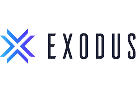

# Exodus Wallet and Its Impact on Future of Personal Banking

## Abstract:  Cryptocurrency wallets are becoming more and more useful for people all over the world.  Wallets are used to store, exchange, and swap digital currencies.  Advanced technologies allow individuals to bypass banking and financial institutions by essentially becoming their own bank.  People will be able to transact goods and services without even having to go to the bank to get cash or write checks.  Transactions that usually took 3-5 days to clear will eventually take minutes or even seconds to transact in the future.  Why pay hefty fees such as $30 wire transfer, or $10 service fees for bank account maintenence when with cryptocurrencies we can pay fractions of a penny to send a friend or family thousands if not millions of dollars?  The purspose of this study is to investigate the potential impact of Fintech in the crypto world, will have on the rest of the banking industry.  Analysis will be made on technology and money transacting processes.  The same concepts that banks used for charging intrest will apply to the lending of crypto assets and how they will generate more crypto as people will want to make use of their idle money.  The results clearly show that money and banking will change in the future as the banking systems around the world will collapse.  This study indicates important points wich include the necessity for financial freedom and personal wealth management.  The future of money will evolve into total control by each individual human being rather than banking institutions.

* Name of company:      Exodus Movement INC.

* Year Incorporated:    2015 in Nebraska

* Status:               Private

* Founded By:           JP Richardson and Daniel Castagnoli

* Why Exodus Wallet:    founded on the values of empowerment, freedom and transparency in finance.
                        1. Safe     2.  Reliable    3.  Trusted
                        Seeing the increase in demand for storing cryptocurrency on a safe exchance
                        and a series of 51% hacks, companies were  trying to develop a place for users to transact securely and with a user friendly interface.  They made it fun and easy to learn and use cryptocurrency.  The great thing about Exodus is that they are constantly updating versions of their technology by having a new release every 2 weeks since 2015.  They support over 100 cryptocurrencies and throughout the years have introduced several new technologies including crypto staking and most recently a public offering to users to become investors of the company. 

* Funding:              Crowd funded by angel investors with initial investment of roughly $346,000.  

                        Exodus generates revenue by charging a fee from the spread when swaping cryptos on the exchange. The exact amount of crypto you will be exchanging and the exact amount of crypto you will receive will be shown to you on the exchange section of the wallet. In highly liquid markets, spreads are tighter, creating a lower cost.  As any broker business, the amount of stock you buy will be a little less because of the small fee.  So for example if you buy $100 worth of bitcoin, you will probably end up with only $99.94 worth plus the change in price in that instance in volitility.

* Quotes from CEO:  “Exodus has achieved success by making finance more user friendly – our users can already easily store, send, receive or exchange crypto assets over the Exodus platform with the speed of  centralized crypto exchanges without the risk or rules of third-party custody. Now we’re taking it a step further and really giving the control back to the user. Initial Coin Offerings have always left investors with no legal ownership and we’re ready to change that. By inviting everyone, not just accredited investors, to contribute to Exodus, we can drive the long-term growth of our mission.”

* Quote from company website:  "Exodus is on a mission to empower half the world to exit the traditional finance system by 2030."   

## Business Activities:

* What is Exodus Wallet?  

    Exodus Wallet is basically a cryptocurrency wallet that stores different types of digital coins.  It is a way for people to keep their cryptocurrencies safe.  Users are able to send, recieve, and exchange cryptocurrencies with ease.  What is mean by ease is that transactions and storage are seamless and fast.  There is no need to forfiet personal information or talk to a personal banker, or stand behind a glass to make financial transactions.  With a crypto wallet, users can transact in the privacy of thier own space.  It is literally the financial freedom that people have been seeking for 100s of years.  Cryptocurrency in general give users complete control over their own money and the value is based on the market supply and demand rather than the manipulation and control of the governments that print fiat.  In the past 10 years crypto experts have been trying over and over to spread the knowlege about this new phenomenom but it has been thwarted by governments because of fear of collapse of countires own currency.  And here we are in 2021, and nothing can stop the power of digital money.  Bitcoin alone was getting so powerful that governements and companies had to get in before the rest of the world.  What better time than the Corona Virus Pandemic is when the world super powers secretly planned their entrance into the future of money.  Every true investor knows that wealth is created by buying low and selling high;  buying dips when the world is in fear, and selling high to cash in when hype skyrockets.  Bitcoin was $3000 in March of 2021 and has skyrocketed to over 50,000 in less than one years time.  This only shows that the demand for cryptocurrencies overall is real and is unstopable.  Years ago nations such as China tried to ban it.  Governments such as the US threatened to trace people down and put hefty capital gains taxes on users who tried to transact with each other.  This was the opportunity of a lifetime for millenials, gen x's, and younger people to take over the world that they have been enslaved in since the begining of their parents lives.  Solutions such as Robinhood and wealthfront started popping up because it was possible to buy fractional shares of companies.  Well, like bitcoin and other cryptos, anyone in the world can buy fractional shares of coins thus enabling anyone and everyone to have money.  Remember even as kids, youd have to be 16 to drive a car or even open a bank account.  so much control was put upon the people by states and governments.  Now even an elementary student can enjoy the taste of power and wealth.  The future will be totally free and happy thanks to crypto.  We must thank the creators of crypto wallets because they have built tools to enable people to store "happiness" aka digital money.  Imagine a world where casinos, restraunts, tennis courts, private schools, walmarts, and even employers will accept and transact in digital dollars.  You can't spread Corona Virus through crypto because you cant even physically touch it.  10 years from now it will all come together and we will be looking back thinking it was all a setup.  Just think about it.  In 2020 things got real wierd.  The whole world went into panic and even Houston, Texas froze over.  Science cant even explain what happend in 2020.  Well believe it or not, Bitcoin was the whole reason why everything in the world turned upside down.  Years from now people will refer to Bitcoin as the new Savior slash religion.  It is already starting to blow peoples minds.  How could a person buy several coins for a couple hundred bucks and turn into a multi millionaire by the turn of the century?  Soon enough, following the big purchases by Square and Tesla, everyone and thier moms will start to pick it up.  Remember how people would quit thier whole life and leave thier family just to travel 2000 miles on a wagon with 3 pairs of clothes and thier father just to travel to Mariposa to set up camp in the gold mines in the California gold rush of the 1920's.  Well guess what?  its 100 years later and here we are flocking into little bootcamps to learn how to integrate with the future of money.  And 100 years from today, money will essentially be knowlege from someones brain.  And the way we earn money is by clapping our hands.

* What specific financial problem is the company or project trying to solve?

    Let us first look into the main problems of the financial system today.  Why is money so hard to obtain?  Why is it that rich people get whatever they want and poor people struggle to hold on to a couple of bucks?  It all comes down to time.  Speed in which money is transacted.  Rich people snap their fingers and a hot plate of steak is served, warm towel to wipe their face, and a nice little foot massage under the dinner table.  Waiters are on stand by waiting for orders just to run to the nearest convenient store to get a beer because the restraunt doesnt have the right drink for the customer.  The customer eats all their food and walks away and doesnt even have to pay a dime; excuse being that the steak was over cooked and if anyone tried to stop them as they were leaving, they would lose thier job and maybe even their shoes.  Money is power.  The poor did not have that at all.  The poor had to expend all of their energy and do back breaking work just for a measly 5 pence to feed a fimily of 12 while the youngest was sick.  When the poor walked into a restraunt they would starve almost to death because they had to wait to be seated.  The host wouldnt even let them in without an explanation.  "you need a collered shirt sir", "no sandals allowed", "you made a reservation for 6 but i see 6 and a half".  the poor man answers "the baby cant sit in moms lap?, you guys cant pull up another chair?"  all while the restaurant is half empty, the hostess says "sorry we have no more seats availible, they are all reserved".  Poor people struggle their whole lives as they are being robbed of time and energy when they dont even know it.  The disparity between the rich and poor was to increase year over year until they were eventually eliminated by fighting each other.  Cryptocurreny; yes Cryptocurrency (may we all capitalize the C when we see it) is the total solution to the worlds problem.  It will bring the human race finally to equality; a dream that was dreamed for many many generations.  Cryptocurrency, a financial solution that will enable people to transact not by the amount of money you have but by the transperency of the code.  As you are reading this case study, you may not fully understand the meaning of the message, but if you continue to read it over and over, it will become more and more clear to you.  Let us begin by the introduction of Exodus and its applications.

    Case #1:  Funding

        Traditionally, when someone wants to make a purchase, they either have to go withdraw cash, use their credit card, write a check, or even do a wire transfer.  If you withdraw more than 10,000 in cash, you have to do an ITR verification.  Private data must be released to the bank and keys must be sent to your phone to identify your identity.  Followed by personal questions like what is your occupation.  When you use a credit card, you have to enter a pin or put in your signiture.  when you write a check, you have to sign and even show ID and it takes days to clear.  When you do a wire, you have to wait 3 to 5 days before it clears.  Why are financial systems putting hold on YOUR money?  With Cryptocurrencies, funding is instant and the costs are fractions of a penny.  It only takes a minimum of 6 confirmations for money to move; in the same time each transacation ends up having over 100,000 confirmations in the blockchain.  That takes us to case #2.

    Case #2:  Security 

        Exodus Wallet along with many up and coming crypto wallets allows users to maintain strong security to thier money.  Not only is crypto secured by a password and backed up by a 24 word private key, it can also be layered with a new technology called 2 factor verification where a code is sent to your mobile unit the second you try to log in and the code changes every 30 seconds incase by a small chance someone sees the code and write it down.  Not even a highly trained spec operative could steal your code and log into your accounts.

    Case #3:  Privacy

        With a Crypto wallet, users are able to maintain their own access without having to go through another human being or entity to access their money.  Crypto wallets allow you to own your own password and keys to recovery even if you lost them.  In the blockchain everything is transparent but private because the money is identified by 24 digit serial numbers, not by a persons name or address.  Any crypto holder could easily transact for goods or services without having a big brother monitor thier transactions.  You and only you will have access to your funds and the information within that matrix.  Everyone can see how much money is in what wallet but will never know who exactly owns that wallet.

    Case #4:  Storage

        You thought for manys of years that the bank was a place to store your money. (smirk)  What was really happening was the bank took your money, stored it into their vault, and used it to make more money, and eventually convinced you that you lost it all because you could not pay your mortgage; or your funds have been frozen by the fed; or you thought you moved your money into gambling accounts, which were secretly owned by banks, and the system eventually took all your money,(because you were 110% sure deontay wilder could not get knocked out) but you really thought you lost it all on a bet on the yankees or dodgers in 2017, only to find out that a simple trash can was drumming out in morse code: ha ha suckers all sales are final and we are programed to believe there are no refunds and soon enough they will ban weapons so that you cant come after your own funds.  while on the other side of the world in singapore they are building super sky high skyscrapers and eating black pepper crabs for breakfast.  As you can see, storage was only a concept until Cryptos came around.  Exodus Wallet allows you to store your own money and own your own keys.  You are probably paranoid now that your safety deposit box has been opened more times than than a boring book.  Remember that the bank always has the spare key and they lock the doors at night.  Once the money leaves your hands, its gone.

    Case #5:  Portablility

        In todays world, banks hardly even have services for you to swap currencies.  you would have to travel to the country and swap currencies either at an exchange center or a local gold shop and probably loose a couple dollars on the premium they charge.  With Exodus Wallet, currencies could be swapped currency for currency at the spot, eliminating any arbitrage loss.  Or at least minimizing it to fractions of the cost you would spend at an airport exchange shop.  Exchange shops and gold shops need to make money to maintian their location.  With crypto wallets, there is no need for physical location becasue swaps can happen instantly on the online wallet.  So say in the future you travel to Vietnam and need some VND coin.  A swap from BTC into another crypto that is linked to VND coin could happen in  a matter of minutes eliminating the need to go to a local bank or exchange shop.  The amount of time a user can save is priceless.  In the future people will be able to make simple transactions from coffee to real estate without having to go through the red tape.

* Who is the company's intended customer?  Is there any information about the market size of this set of customers?

    Believe it or not, Exodus has the potential to drastically disrupt world financial markets.  If they continue to do what they do consistantly, they could be the next Crypto equivelent to JP Morgan Chase.  They major advantage that they have is that their solution is very very easy to use and is very user friendly.  Its just like any online banking solution; people tend to use a well known big bank and big banks invest billions into their online banking interface for their everyday mulitple millions of users.  The market is wide open for Exodus.  With over a million users and counting, they still havent penetrated 1% of world markets.  Since the company is still small and private, there is no real data on the current market size or exact user count, however they maintiain great service and continue to show strong reviews all over the internet.  They are constantly updating their version every 2 weeks and continue to imporove userability.  Everything about Exodus is top notch and it will only be a matter of time before the world notices them and they go viral.

* Which technologies are they currently using, and how are they implementing them?  What solution does this company offer that their competitors do not or cannot offer? (What is the unfair advantage they utilize?)

Exodus wallet is a so called hot wallet which uses software to store your cryptocurrencies on the interent.  Unlike a cold wallet (nano ledger or Trezor), cryptos stored on Exodus are online and managed through their application solution.  The good thing about this is that it is easily accessible and easy to use through there user friendly gui interface.  The navigation is very simple and straight forward; perfect for begginers.  More advanced users may choose solutions such as Kracken or Binance which allow live market trading of cryptos however are less safe when it comes to storing.  Exodus gives you a relatively-safe cryptocurrency wallet for daily use. Since it is an online wallet, it will never be as secure as leaving digital currency in cold storage (such as a paper wallet). It also lacks some features which make it less secure than other, more complex software wallets.

Breakout Features:

        Desktop Wallet               with 130+ Cryptocurrency Assets capablility
        Mobile Wallet                Wallet on iphone/android phone completely portable take anywhere around the world and move crypto
        Trezor Hard Wallet           Integration into Trezor USB wallet/ Cold Wallet for complete unhackable security   local storage
        Crypto Staking               Stake (lend) your own crypto to gain interest in that same crypto
        Compound Finance             Traditional bank rate intrest on Crypto assets
        Currency Swap                Any Crypto to Any Crypto
        New Feature Apps coming      Private Data Storage, 24 hour human support
        Exodus Public Offering       Has filed with SEC in the Beggining of March of this year 
        Instant Registration         Exchange 24/7 - In seconds      setup another user in minutes

As time goes by, they will have more and more money to develop their solutions and will eventually turn into a World Class Company.        

## Landscape:

* What domain of the financial industry is the company in? 

    Cryptocurrencies, Crypto Banking, Crypto Payments, Crypto Send, Crypto Recieve, Crypto Exchange/swap, Crypto APY Rewards, Crypto Transfers

* What have been the major trends and innovations of this domain over the last 5-10 years?  

    Began as a local desktop wallet and has evolved into full service cryptocurrency support economy and will become an all in one Crypto Base for almost anyone

* What are the other major companies in this domain?(or shall we say who is adopting bitcoin)  coinbase, binance, blockchain.com, xapo, Gemini, Bitstamp, Bitcoin.com, Crypterium, Robinhood, Paypal, Kraken, Square, Betus, 5 dimes, Tesla, Master Card, Visa, Kodak, Dharma, Amazon, Micro Strategy, Galaxy Digital Holdings, Grayscale Bitcoin Trust, CoinShares, Ruffer Investment Company, 3iQ The Bitcoin Fund, ETC Group Bitcoin ETP, Bitwise, Microsoft, Overstock, Home Depot, Namecheap, Starbucks, Bed Bath and Beyond, Twitch, Whole Foods, New Egg, Dallas Mavericks, Miami Dolphins, At^t, Virgin Mobile, Expedia.com, Cheapair.com, ScubaOtter, Curtain University, Wikipedia, Wikileaks, QSR, ETSY, Coca Cola, YUM Brands, the list goes on and on and growing at an exponential rate.  It only a matter of time before Bill Gates changes his mind, Jamie Dimon finally admits to it, The guy at McCaffee will eat his own leg.  Its going to blow up right before our eyes and faster than anyone can believe.  In the old days it was only a matter of time before the US governement was minting coins then minting paper.  Its going to be a revolution.  History shows that when the Fibonnaci model explodes, world wide addoption happens instantly.  Look at China and WeChat.  They are moving less and less off of paper payments and more into mobile payments.  Time is money.  It will eventually end up where you eat your food and you just stand up and walk out the door and the reader already deducts the money from the chip in your body (or on your body/ a wearable)  Everything will be seamless and free from checkpoints and money will flow smoother than air.

## Predictions

* What will the world be like 5-10 years from now?

    Many things can happen soon, but most likely there will be chaos.  People as a whole will go to war with capitalist societies and governemnts.  Governments will again attempt to ban cryptocurrencies for fear of losing control of the banking sector.  Bitcoin and cryptos will over power them like a tsunami.  People will create their own societies, create their own currencies, follow thieir own rules, pay for thier own economies.  People wont need to pay taxes anymore.  People will not need to buy health, car, home insurance.  There will be an end to this thievery that has been put upon the people since the great egyptian times.  People will realize that they have been enslaved since the begining of time.  We are slaves to a salary.  Our masters are capitalists that try to use us to build empires that we will never own.  Wars will be fought again and new territries and boundaries will be drawn.  For example Texas will be owned by  cartels and only use CroketCoin as payment.  Western United States will be infiltrated by South East Asian Alliance and Disneyland will turn into a prison.  There will be no more borders with checkpoints.  People will be free to roam without passports.  The United States will not be the superpower anymore.  Imagine once rural suberbian households will be subject to picking up trash in now 3rd world countires earning Dogecoin.  Once living in a mansion with A/c to flipping shrimp burgers in a himilayan camp earning cryptos so they could move to a better life a little bit west only to find out their new job is cutting down banana trees to build homes for the new rich crypto holders.  Soon everyone in america will be millionaires in dollers only to find out that the dollar has collapsed to zero and can only be used as burning paper to heat themselves in the north and padding for a place to sleep in the streets.  People will be wetting their pants for not buying Charmin Toilet paper NFT.  CryptoCurrencies will be the new money of the world and Warren Buffet will finally be broke going door to door selling his omaha steaks that were fronted to him by a bum.  It would take him 5 more years to earn him enough crypto to buy a can of cherry coca cola.  He will regret spending billions of dollars on that vaccine he bought that enabled him to live forever.

## Recommendations

* As a Crypto Advisor:  I recommend Exodus to continue its excellent work and to use its new sources of funds to invest in people who can build applications.

            Key solutions for the short term:
                    
                    Enable users to pay for car insurance, gym memberships, pay off credit cards with crypto, and even pay for gas/electricity 
                    They should partner with paypal, square, mastercard, visa so that users can shop online with crypto
                    Enable users to use their crypto and buy services such as health insurance, pay for a lawyer, house cleaning, etc.
                    Enable users to pay for tuition, exchange forign currency, buy a house instantly
                    Book airline and hotel, reserve spots in line, call an uber or taxi
                    Gain credit at the casino and earn rewards, get comps at restraunts, earn points to get free tickets to shows
                    Applications that enable a crypto user to buy a Rolex, enter a boxing match, rent an exotic vehicle
                    Enable clients to buy stocks and bonds, gold, silver
                    

* Why do you think that offering this product or service would benefit the company?
  Why are these technologies appropriate for your solution? 
  What technologies would this additional product or service utilize?

    A wallet is just a place to store your money.  What use is it if you dont have an avenue to spend it in the real world?  If Exodus is able to add an application to which users could turn their crypto into cash, then users could spend their money to buy goods and services.  The company would benifit because they would attract a more broader range of customers and they would also be entering another arena with bigger players in the fintech space.  It would also further help the company partner up with big companies. For example what if United Airlines was able to offer people to purchase drinks onboard using your exodus wallet.  You can see there is massive potential for this small wallet company.  They would use blockchain technology to turn crypto into cash.  Most likely they will partner up with either Coinbase or Kraken to enable users to exchange Crypto into cash and finally move it into a bank account where they could use those transaction services.  Ultimately if they could offer this solution directly embeded into their wallet solution and bypass the traditional banking system, they will be able to change the world.
 
## Websites Cited:

https://www.techradar.com/reviews/exodus-cryptocurrency-wallet
https://www.crunchbase.com/organization/exodus-052e
https://99bitcoins.com/bitcoin-wallet/exodus-review/
https://icoholder.com/blog/exodus-wallet-review/
https://wallets.com/exodus-review/
https://support.exodus.com/article/90-how-does-exodus-make-money#:~:text=Exodus%20generates%20revenue%20from%20a,the%20spread%20on%20asset%20exchanges.&text=The%20exact%20amount%20of%20crypto,tighter%2C%20creating%20a%20lower%20cost.
https://www.globenewswire.com/news-release/2021/03/03/2186295/0/en/Exodus-Files-with-the-SEC-to-Allow-the-Public-to-Purchase-its-Common-Stock-with-Bitcoin-in-Regulation-A-Public-Offering.html
https://www.exodus.com/investors/
https://medium.com/exodus-movement/10-reasons-e7ef06042cae     Cons of Exodus Wallet
https://www.coinbureau.com/review/exodus-wallet/
https://www.google.com/search?q=what+does+warren+buffett+like+to+eat&sxsrf=ALeKk02xx7vj3PP4Mbkb4nXu2LViahM3VA%3A1616220825747&source=hp&ei=mZJVYLKVK8SEtQXZvbTABg&iflsig=AINFCbYAAAAAYFWgqZ0bkceBQ7Ev703TLvN2bfQkbGYM&oq=what+does+warren+buffett+like+to+eat&gs_lcp=Cgdnd3Mtd2l6EAMyBggAEBYQHjIGCAAQFhAeMgYIABAWEB4yBggAEBYQHjIFCAAQhgMyBQgAEIYDMgUIABCGAzoECCMQJzoFCAAQkQI6CAgAELEDEIMBOgsILhCxAxDHARCjAjoOCC4QsQMQgwEQxwEQowI6BQgAELEDOgcIABCHAhAUOgIIADoKCAAQhwIQsQMQFDoICAAQsQMQyQM6BQgAEJIDOgUIABDJAzoECAAQCjoFCAAQzQJQ-A5Y4kpgs01oAHAAeACAAecBiAGrG5IBBzI0LjExLjGYAQCgAQGqAQdnd3Mtd2l6&sclient=gws-wiz&ved=0ahUKEwjyxcfhm77vAhVEQq0KHdkeDWgQ4dUDCAo&uact=5  what does warren buffett like to eat

